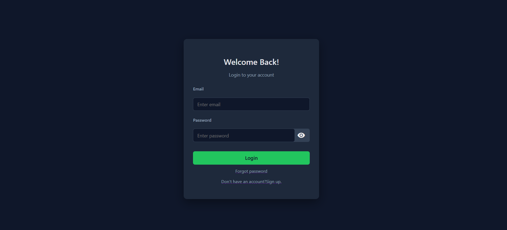
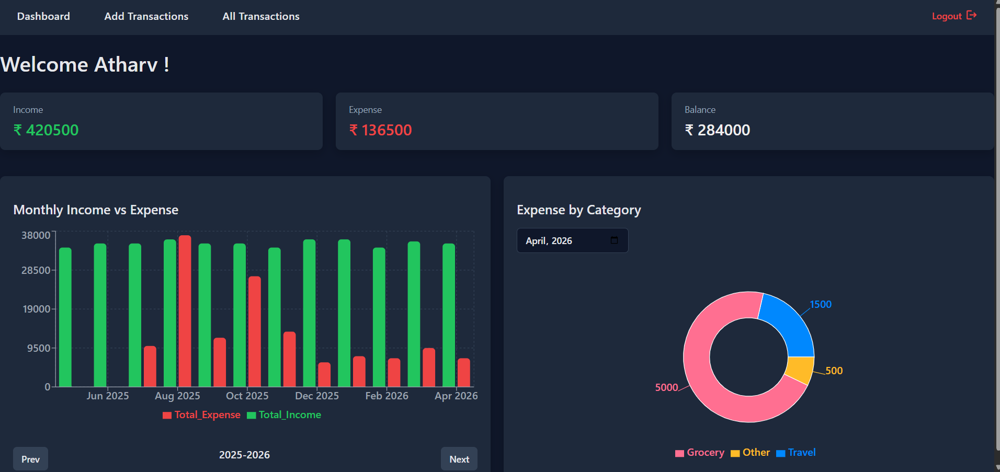
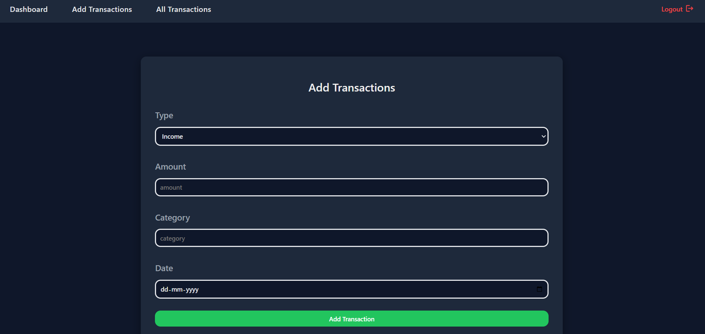
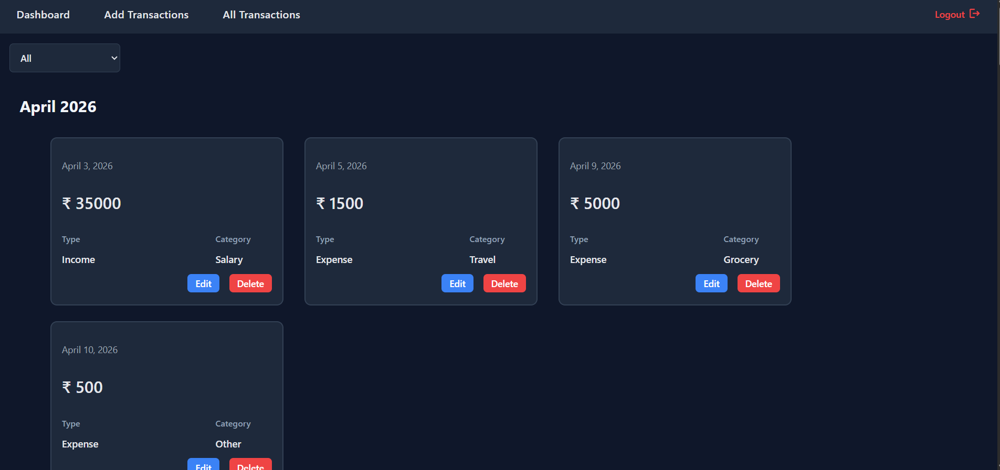

# Personal Finance Tracker

> A simple and powerful web app to track your monthly and yearly expenses and savings in one place.

---

## Features
- User Authentication
- Track Income & Expenses
- Transaction Management
- Categorize Transactions
- Monthly expense overview
- Visual charts for spending analysis
- Secure and private data handling

## Tech Stack

### Frontend
- React.js
- CSS
- Recharts
- axios

### Backend
- Node.js
- Express.js
- JWT Authentication
- REST Api

### Database
- MongoDB

## Screenshots

### Authentication Page
 

### Dashboard Page

### Add Transaction Page

### All Transactions Page

